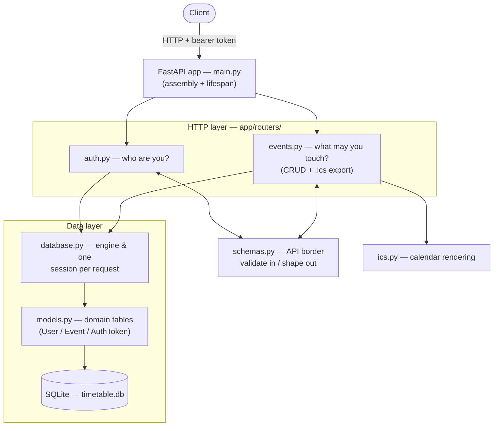

# USThing Timetable Service

Backend service for custom timetable events — USThing Backend Technical Test
2026, Task 1.

A REST API that lets each user create, read, update and delete custom events
in their own timetable, with a minimal token-based authorization layer and
per-user data isolation.

## Status

Feature-complete: multi-user auth, CRUD, `.ics` export, 22-test suite,
Docker packaging. See *Design & Architecture* below.

## Stack

- Python 3.13 + FastAPI
- SQLite + SQLAlchemy
- uv (dependency management), ruff (lint + format), pytest (tests)

## Design & Architecture

The service is layered with one rule: **dependencies point downward, never
upward.** The domain layer (`models.py`) knows nothing about sessions or
HTTP; the plumbing (`database.py`) knows nothing about HTTP; the Pydantic
border (`schemas.py`) touches neither. The routers are the only place the
worlds meet — which is where authentication hands off to per-resource
authorization.



The same shape in words: a request enters through the assembled FastAPI app,
gets **authenticated** (`auth.py` resolves the bearer token to a user), gets
its payload **validated at the border** (`schemas.py`), and reaches the
domain only through a request-scoped session that talks to SQLite via the
ORM models. The `.ics` export is a pure serializer over already-authorized
data. No layer reaches upward.

Layer responsibilities at a glance:

| Layer | File(s) | Owns | Never touches |
|---|---|---|---|
| Assembly | `main.py` | lifespan, router mounting | business logic |
| Border | `schemas.py` | input validation, output shaping | the database |
| HTTP | `routers/auth.py`, `routers/events.py` | authn gate, ownership scoping, stored-state rules | SQL details |
| Serialization | `ics.py` | RFC 5545 rendering | HTTP, SQL |
| Domain | `models.py` | tables, constraints, types | sessions, HTTP |
| Plumbing | `database.py` | engine, sessions, pool, env | business rules |

Lifecycle of one authenticated write (`POST /events`):

1. uvicorn → FastAPI routing; `get_current_user` resolves the bearer token
   (hash → `auth_tokens` row → `User`) — **who**
2. body validated into `EventCreate` — garbage dies as 422 at the border
3. handler stages `Event(user_id=current_user.id, …)` and commits —
   **ownership** assigned server-side, `INSERT` via `ISODatetime`
4. the ORM object is serialized through `EventRead` (`from_attributes`) —
   only schema-declared fields leave the service

## Running (dev)

```sh
uv run uvicorn app.main:app --reload
```

Interactive API docs: http://localhost:8000/docs
